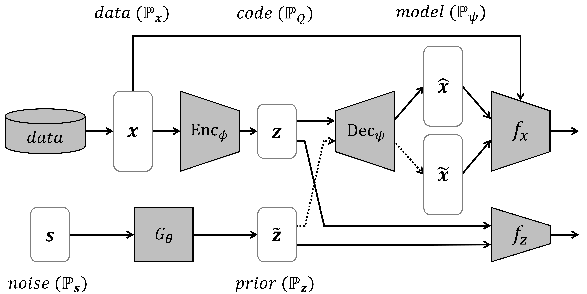
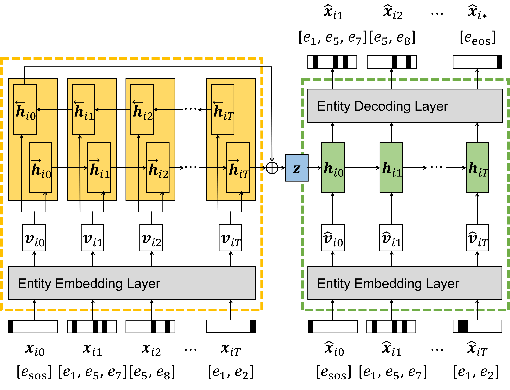

# Dual Adversarial AutoEncoder (DAAE) for EHR Generation

- This is a PyTorch implementation of "Generating sequential electronic health records using dual adversarial autoencoder", published in Journal of the American Medical Informatics Association (JAMIA) 2020.

## Overview
<p align="center">

</p>

> The DAAE architecture that is composed of 1) **the seq2seq autoencoder**, 2) **the inner GAN**, and 3) **the outer GAN**.

<p align="center">

</p>

> The detailed architecture of **the seq2seq autoencoder**. The embedding layer encodes the semantics of all the medical entities, and the GRU layer learns the temporal contexts within patients' sequential records.

## Running the Code
#### Step 1. Installing Python and PyTorch

- Install `Python 3` and `PyTorch`.

#### Step 2. Preparing Data

- You need .npy (numpy file format) files of EHR.
- It should be in the form of a dictionary, whose `key` is **the patient-id** and `value` is **the set-valued sequence of the patient**.
- For example,
```
  {   17: [['7455', '45829', 'V1259', '2724'], ['4239', '5119', '78551', '4589', '311', '7220', '71946', '2724']],
      21: [['41071', '78551', '42731', '1122', '2720', '2749', 'V1046', '43889'], ['0388', '78552', '40391', '42731',  '25000', '2859', '43889', '2749', '41401', '185', '4439', '2449']],
      ...,
   99982: [['42823', '4254', '2875', '5303', '4280', 'V5861', '45829'], ['4280', '42823', '5849', '4254', '2763', '42731', '78729', '2768'], ['5849', '42731', '4280', '2875','V422', '7994']]}
```
- Each entity (i.e., diagnosis code) must be provided as string format.
- In the input data directory, two .npy files should be required respecitvely for training and validation: `ehr.train.npy` and `ehr.valid.npy`.

#### Step 3. Running DAAE on your Data

- Now, you are ready to learn the sequences about real patients and synthesize fake ones.
```
  python train_daae.py --data_dir <input_directory> --create_data --gendata_size <#_fake_sequences>
```
- Finally, you will obtain the two files about fake patients: `daae_generated_codes.npy` and `daae_generated_patients.npy`.
- These are basic arguments you can specify:

Argument | Description
--- | ---
--data_dir | The path to the input nummpy files
--max_sequence_length | The maximum length of sequential records (default: 10)
--max_visit_length | The maximum number of entities in a single record (default: 40)
--gendata_size | The number of fake sequences to be generated (default: 100,000)
--batch_size | The size of a single mini-batch for set-valued sequences (default: 32)
--learning_rate | The initial learning rate for the ADMM optimizer (default: 0.001)
--epochs | The total number of epochs for training (default: 500)
--gpu_devidx | The index of GPU to be used (default: 0)

- The detailed architecture of each componenet (i.e., encoder, decoder, generator, and inner/outer critics) can be specified by using the following arguments:

Argument | Description
--- | ---
--rnn_type | The type of RNN encoder and decoder (default: 'gru')
--embedding_size | The dimensionality of the entity embedding layer (default: 128)
--hidden_size | The dimensionality of hidden vectors in RNN encoder and decoder (default: 128)
--noise_size | The dimensionality of noise vectors (default: 128)
--latent_size | The dimensionality of code vectors (default: 128)
--filter_size | The number of conv filters in the outer critic (default: 16)
--window_sizes | The widths of conv filters in the outer critic (default: \[2, 3\])
--bidirectional | The flag indicating the RNN encoder is bidirectional (default: False)
--entity_dropout | The entity dropout rate for decoder input sequences (default: 0.05)
--embedding_dropout | The dropout rate for the entity embedding layer (default: 0.5)
--feature_dropout | The dropout rate for the fc layer in the outer critic (default: 0.5)
--gmlp_archs | The MLP architecture of the generator (default: \[128, 128\])
--dmlp_archs | The MLP architecture of the inner critic (default: \[256, 128\])

#### Step 4. Using a differentially-private (DP) optimizer

- If you need to guarantee the synthetic samples do not leak private information about the training data, you can use a DP optimizer when training the model.
- Install the [PyVacy](https://pypi.org/project/pyvacy/) package and run the code with `--dp_sgd` set to `True`.
- You can control the privacy budget by the following arguments: `--noise_multiplier`, `--l2_norm_clip`, and `--delta`.
- Note that there is a trade-off between the privacy guarantee and the quality of generated sequences.

## Citation
```
@article{lee2020generating,
  author = {Lee, Dongha and Yu, Hwanjo and Jiang, Xiaoqian and Rogith, Deevakar and Gudala, Meghana and Tejani, Mubeen and Zhang, Qiuchen and Xiong, Li},
  title = {Generating sequential electronic health records using dual adversarial autoencoder},
  journal = {Journal of the American Medical Informatics Association},
  volume = {27},
  number = {9},
  pages = {1411-1419},
  year = {2020},
  month = {09}
}
```
